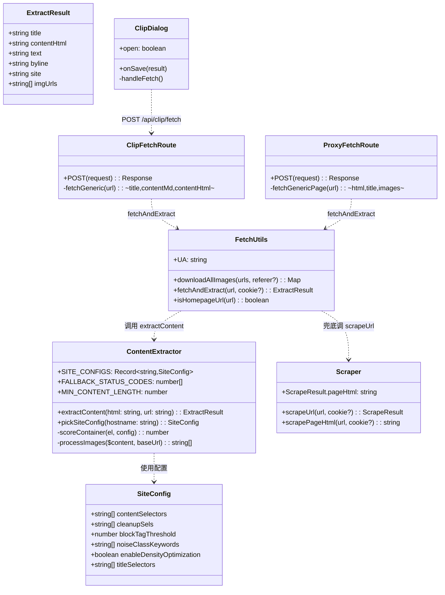
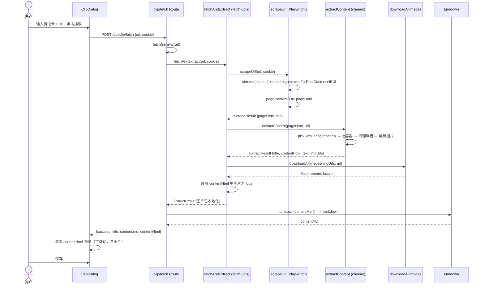
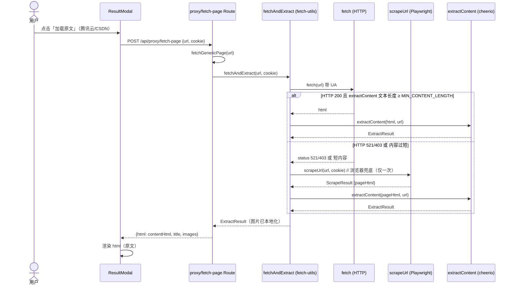
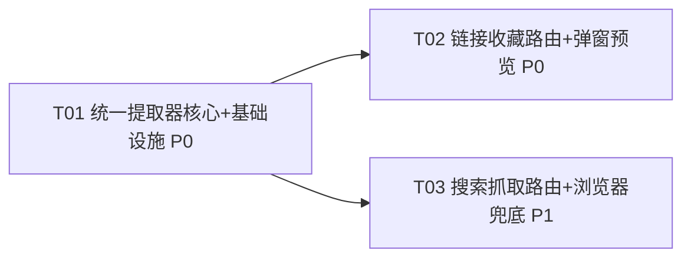

# 统一内容提取器 — 系统设计与任务分解

> 作者：软件架构师（高见远）  ·  项目：ai-notes（Next.js 15 monorepo，端口 8877）
> 目标：抽出一个 **"HTML 字符串进、结构化内容出"** 的 cheerio 纯函数提取器，让「链接收藏」与「搜索抓取」两条路径共用，优先修好腾讯云，并预留多站点扩展。

---

## Part A：系统设计

### 1. 实现方案与框架选型

**核心难点**

1. 两条路径（链接收藏走浏览器 `scrapeUrl`；搜索抓取走 `fetch`+cheerio）各自维护一份选择器/清理逻辑，结果不一致 → 腾讯云在一条路径能抓、另一条抓空（Bug #1）。
2. 知乎反爬（反爬核心不可动）、CSDN 的 521 WAF 拦截服务端 HTTP（Bug #5）。
3. 链接收藏弹窗太小、看不到全文与图片（Bug #2）；知乎链接收藏失败（Bug #3）；知乎搜索抓取只抓一段（Bug #4）。

**关键架构洞察（采用）**

- 两条路径最终都能拿到「HTML 字符串」：链接收藏经 `scrapeUrl()` 浏览器渲染后返回 HTML；搜索抓取经 `fetch`/cheerio 或 fallback 到 `scrapeUrl()` 也拿到 HTML。
- 因此统一提取器应是 **「HTML 字符串进、结构化内容出」的 cheerio 纯函数，与 Playwright 完全解耦**。
- 让 `scrapeUrl()` 在渲染完成后额外 `await page.content()` 返回 `pageHtml`；原有的 `extractPageContent()`（live DOM）保留给知乎本轮回退，下轮回退即可删除。

**框架选型**

| 关注点 | 选型 | 理由 |
|---|---|---|
| HTML 解析/提取 | **cheerio ^1.2.0**（已依赖） | 服务端纯函数、零浏览器依赖、选择器与现有逻辑可平滑移植 |
| Markdown 转换 | **turndown ^7.2.4**（已依赖） | 路由层 presentation 关注点，保留在 route 中 |
| 站点策略 | **配置表 `SITE_CONFIGS: Record<domain, SiteConfig>`** | 腾讯云配全；知乎/CSDN 留扩展位，后续仅补配置即可切换 |
| 浏览器兜底 | 复用现有 `scrapeUrl()`（**不改 Akamai 核心**） | `getBrowser()` 的 `channel:'chrome'`、`stealthInitScript()` 11 维、`zhihu page.goto('https://www.zhihu.com/')` pre-nav + URL polling 一律不动，仅微调等待时长/UA 版本 |

**scrapeUrl 改造方式**

- `ScrapeResult` 新增 `pageHtml: string`（渲染后完整 HTML）。
- 在现有提取逻辑附近（页面稳定后）调用 `const pageHtml = await page.content();` 并返回。
- 新增轻量封装 `scrapePageHtml(url, cookie?)` 供兜底调用，返回 `pageHtml`。
- **知乎本轮回退**：`scrapeUrl` 仍返回 `contentHtml`/`images`，知乎两路由沿用旧逻辑；统一提取器已内置知乎站点配置，下轮把知乎切到 `extractContent(pageHtml)` 即可。

**fallback 触发条件（搜索抓取）**

- HTTP 状态码命中 `FALLBACK_STATUS_CODES = [403, 429, 500, 502, 503, 521, 999]`（含 CSDN 521、WAF 拦截）。
- 或 `fetch` 正常但 `extractContent(html).text.length < MIN_CONTENT_LENGTH`（默认 `500`，即内容过短/选错容器）。
- 仅当来自 HTTP 路径且尚未用过浏览器时才兜底，避免死循环（`fetchAndExtract` 用 `usedBrowser` 标记）。

---

### 2. 文件列表（相对路径）

**新建**

- `apps/web/src/lib/content-extractor.ts` — 统一提取器：类型、`SITE_CONFIGS` 配置表、`extractContent()`、FALLBACK 常量。
- `docs/system_design.md` / `docs/sequence-diagram.mermaid` / `docs/class-diagram.mermaid` — 本设计交付物（非运行时代码）。

**修改**

- `apps/web/src/lib/scraper.ts` — `ScrapeResult` 增加 `pageHtml`；渲染后 `page.content()` 捕获；新增 `scrapePageHtml()`。
- `apps/web/src/lib/fetch-utils.ts` — 新增 `fetchAndExtract(url, cookie?)` 编排（HTTP→extract→兜底浏览器→extract→下载图片→替换）；集中图片下载工具；导出 FALLBACK 常量。
- `apps/web/src/app/api/clip/fetch/route.ts` — `fetchGeneric` 改用 `fetchAndExtract`；响应新增 `contentHtml` 供预览；删除与 `fetch-utils` 重复的本地下载函数。
- `apps/web/src/app/api/proxy/fetch-page/route.ts` — `fetchGenericPage` 改用 `fetchAndExtract`（自带兜底）；保留微信/知乎分支。
- `apps/web/src/components/clip/ClipDialog.tsx` — 弹窗放大至 `max-w-3xl`（略小于笔记详情 `max-w-4xl`）；预览区渲染 `contentHtml`（全文+图片，可滚动）。
- `apps/web/src/app/globals.css` — 新增 `.clip-preview` 富文本容器样式（图片 `max-width:100%` 等）。

---

### 3. 数据结构与接口（类图）



**关键类型签名（示意，非实现）**

```ts
// content-extractor.ts
export interface ExtractResult {
  title: string;
  contentHtml: string;   // 清理后的正文 HTML（图片为绝对远程地址）
  text: string;          // 纯文本（用于长度阈值/摘要）
  byline?: string;
  site?: string;         // 命中的站点 key
  imgUrls: string[];     // 绝对化后的图片地址列表
}

export interface SiteConfig {
  contentSelectors: string[];   // 正文候选容器选择器（优先级从高到低）
  cleanupSels: string[];       // 该站点专属噪音选择器
  blockTagThreshold?: number;  // 达到该 block 标签数则跳过密度优化（保护结构化正文）
  noiseClassKeywords?: string[];
  enableDensityOptimization?: boolean;
  titleSelectors?: string[];   // 标题兜底选择器
}

export const SITE_CONFIGS: Record<string, SiteConfig> = {
  'cloud.tencent.com': { /* 全配 */ },
  'zhihu.com':         { /* 扩展位（下轮启用） */ },
  'csdn.net':          { /* 扩展位（下轮启用） */ },
  // ... 其它站点
};

export const FALLBACK_STATUS_CODES = [403, 429, 500, 502, 503, 521, 999];
export const MIN_CONTENT_LENGTH = 500;

export function extractContent(html: string, url: string): ExtractResult;
```

---

### 4. 程序调用流程（时序图）

**A. 链接收藏路径（腾讯云，本轮回退重点）**



**B. 搜索抓取路径（通用站 + 浏览器兜底，覆盖 CSDN 521）**



---

### 5. 不确定项 / 假设（简述）

- 假设 `page.content()` 能拿到 JS 渲染后的完整 DOM（Playwright 中成立）。
- 假设删除知乎的 `page.evaluate(extractPageContent)` 不会破坏本轮回退（知乎本轮回退仍走旧 `contentHtml` 分支，不受影响）。
- 腾讯云具体正文选择器以实测为准（开发时用 `FALLBACK`/调试日志核对 `.J-markdownBody` 命中）。
- 弹窗像素"略小于笔记详情"按 `max-w-3xl`(768px) < `max-w-4xl`(896px) 处理（详见待明确事项）。

---

## Part B：任务分解

### 6. 依赖包列表

```
- cheerio@^1.2.0        # 已依赖：统一提取器 HTML 解析（无需新增）
- turndown@^7.2.4      # 已依赖：路由层 Markdown 转换（保留在 route）
- playwright@^1.61.1   # 已依赖：浏览器兜底（scrapeUrl 复用，不改核心）
```
> 本轮**无需新增任何依赖**。

### 7. 任务列表（按依赖/实现顺序，≤5 个，每个 ≥3 文件）

> **T01 为基础设施/核心模块**，T02/T03 均依赖它。腾讯云相关排最前。

- **T01 — 统一提取器核心 + 共享基础设施**  `优先级 P0`  `依赖：无`
  - `apps/web/src/lib/content-extractor.ts`（**新建**：`ExtractResult`/`SiteConfig` 类型、`SITE_CONFIGS` 配置表含腾讯云全配 + 知乎/CSDN 扩展位、`extractContent()`、`FALLBACK_STATUS_CODES`/`MIN_CONTENT_LENGTH`）
  - `apps/web/src/lib/scraper.ts`（**改**：`ScrapeResult` 增 `pageHtml`；渲染后 `page.content()` 捕获；保留 `contentHtml`/`images` 供知乎回退）
  - `apps/web/src/lib/fetch-utils.ts`（**改**：新增 `fetchAndExtract(url, cookie?)` 编排 HTTP→extract→兜底浏览器→extract→下载图片→替换；集中图片下载工具；导出 FALLBACK 常量）

- **T02 — 链接收藏路由接入 + 弹窗预览增强（腾讯云优先）**  `优先级 P0`  `依赖：T01`
  - `apps/web/src/app/api/clip/fetch/route.ts`（**改**：`fetchGeneric` 改用 `fetchAndExtract`；响应新增 `contentHtml`；删除与 `fetch-utils` 重复的本地下载函数）
  - `apps/web/src/components/clip/ClipDialog.tsx`（**改**：`max-w-lg`→`max-w-3xl`；预览区渲染 `result.contentHtml` 全文+图片，可滚动）
  - `apps/web/src/app/globals.css`（**改**：新增 `.clip-preview` 富文本容器样式，图片 `max-width:100%`）

- **T03 — 搜索抓取路由接入统一提取器 + 浏览器 fallback**  `优先级 P1`  `依赖：T01`
  - `apps/web/src/app/api/proxy/fetch-page/route.ts`（**改**：`fetchGenericPage` 改用 `fetchAndExtract`（自带 521/403/短内容兜底）；保留微信/知乎分支）
  - `apps/web/src/lib/scraper.ts`（**改**：新增 `scrapePageHtml(url, cookie?)` 轻量封装供兜底）
  - `apps/web/src/lib/fetch-utils.ts`（**改**：`fetchAndExtract` 针对 proxy 返回形态微调/复用）

> 知乎/CSDN 的"切到统一提取器"作为**下一轮**任务（配置已预留），本轮不阻塞。

### 8. 共享知识（跨文件约定）

- **选择器配置表格式**：`SITE_CONFIGS[hostname] = { contentSelectors, cleanupSels, blockTagThreshold?, noiseClassKeywords?, enableDensityOptimization?, titleSelectors? }`；全局基础噪音选择器在 `extractContent` 内合并，站点专属只在 `cleanupSels` 追加。
- **日志前缀约定**：`[extractor]`（content-extractor）、`[scraper]`（scraper）、`[clip/fetch]`、`[proxy/fetch-page]`、`[fetch-utils]`。
- **FALLBACK 阈值常量位置**：`FALLBACK_STATUS_CODES` 与 `MIN_CONTENT_LENGTH` 定义在 `content-extractor.ts` 并 `export`，`fetch-utils` 复用，勿在路由内硬编码。
- **图片下载唯一入口**：`fetch-utils.downloadAllImages`（已存在）；`clip/fetch/route.ts` 删除本地副本，统一 import。
- **contentHtml vs markdown 约定**：提取器只产出 `contentHtml`（图片为绝对远程地址）；路由负责下载替换 + 按需 `turndown` 成 markdown。`clip/fetch` 返回 `{title, content(md), contentHtml}`；`proxy/fetch-page` 返回 `{html: contentHtml, title, images}`。
- **绝对化规则**：图片 `data-src/data-original/data-lazy-src/srcset` → `src`；相对路径用 `new URL(url).origin` 补全；与现有 `extractPageContent`/`fetchGenericPage` 行为一致。
- **Akamai 禁区**：`getBrowser()` 的 `channel:'chrome'`、`stealthInitScript()` 11 维、知乎 `page.goto('https://www.zhihu.com/')` pre-nav + URL polling —— 任何任务**不得修改其结构**，仅可微调等待时长/UA 版本号。

### 9. 任务依赖图



---

### 交付 #8：待明确事项（需用户/主理人确认）

1. **弹窗像素**：当前 `ClipDialog = max-w-lg(512px)/max-h-[85vh]`，`ResultModal(笔记详情) = max-w-4xl(896px)/max-h-[85vh]`。方案取 `max-w-3xl(768px)`（略小于 896px）且 `max-h` 维持 `85vh`（或改 `80vh`）。请确认是否接受，或给出具体像素。
2. **预览是否显示图片**：`ClipDialog` 预览目前是 markdown 文本切片。若要在保存前看到图片，需 `clip/fetch` 额外返回 `contentHtml`（已在 T02 规划）。确认弹窗预览渲染 HTML（含图片）是否符合预期。
3. **知乎本轮是否做**：用户已确认"知乎/CSDN 后续迭代"。本设计本轮只修腾讯云 + 通用兜底（顺带改善 CSDN 521），知乎仍走旧 `contentHtml` 分支。请确认知乎不纳入本轮验收。
4. **`extractPageContent` 是否本轮删除**：为"克制改动 + 知乎回退"保留；建议下轮（知乎切换后）删除。请确认保留策略。
5. **CSDN 是否本轮验证**：fallback 机制会自然让 CSDN 521 走浏览器兜底，但 CSDN 站点配置（选择器）本轮仅留扩展位、未实测。请确认 CSDN 仅"能兜底出内容"即可，不做精细调优。
6. **`MIN_CONTENT_LENGTH=500` / `FALLBACK_STATUS_CODES`** 数值是否需按实测调整（可在开发时用调试日志核对）。
